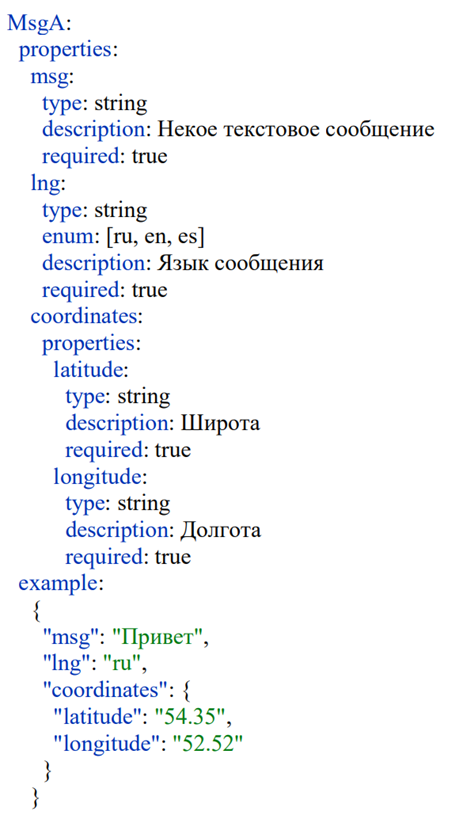
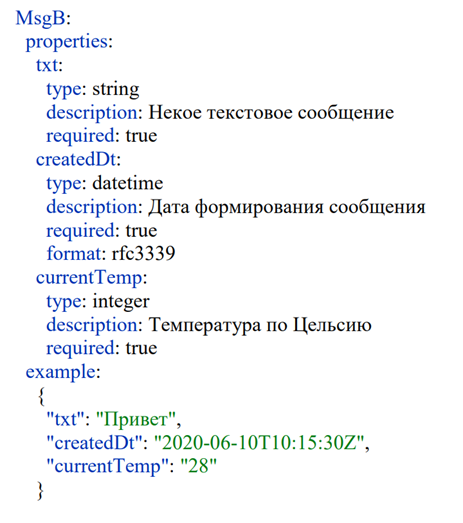

##Тестовое задание middle Java (примерное время 5-7ч).##
Написать микросервис «Adapter», который принимает сообщение из «Service А», производит преобразования, описанные ниже, и передает его в «Service B». 

Ниже приведена схема взаимодействия:
1. Коммуникация между всеми микросервисами осуществляется с использованием архитектурного стиля REST. 
2. Формат сообщений, отправляемых «Service А» определен в формате RAML и имеет следующий вид:

3. Требуется обрабатывать сообщения только с признаком "lng": "ru" и, используя координаты, обогащать сообщение данными из сервиса погоды. Сообщения, не прошедшие условия фильтрации – игнорировать. Если сервис погоды недоступен – считать это ошибкой.
4. Одним из возможных форматов API сервиса погоды можно предложить формат Gismeteo (https://www.gismeteo.ru/api/). Стоит учесть, что в дальнейшем список поддерживаемых сервисов погоды с их форматами будет расширяться.
5. Формат сообщений принимаемых сервисом «В»:

6. Добавить обработку ошибок при получении пустого сообщения из сервиса “А”. Пустым сообщением считать сообщение, не содержащее ни одного символа в поле “msg”.
7. Использовать Maven для сборки проекта
8. Настройка Spring с помощью Java-аннотаций
Результат выполнения задачи:
- исходный код приложения в git-репозитории
- документация по API
